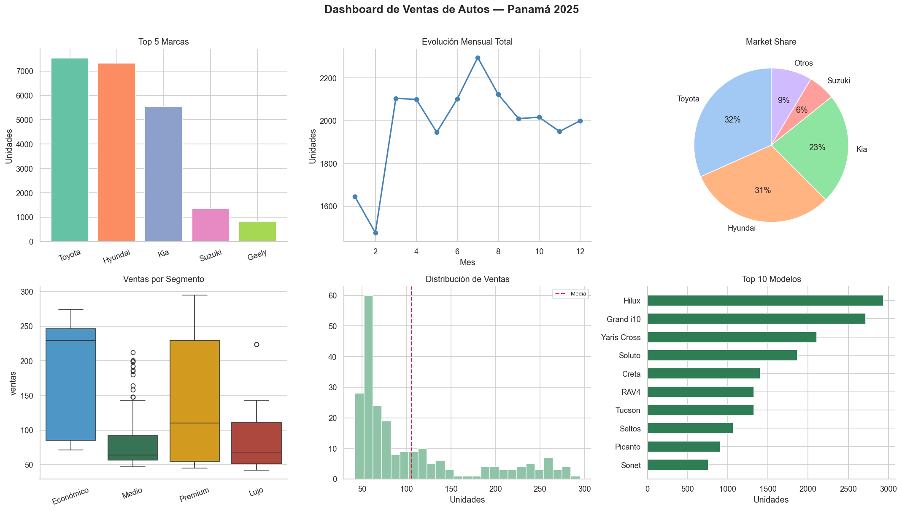
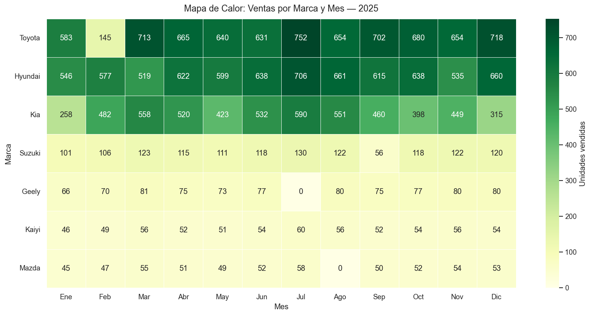

# Análisis Exploratorio y Visualización — Ventas de Autos en Panamá

Proyecto de análisis exploratorio de datos (EDA) y visualización aplicado a un dataset simulado de ventas de automóviles en Panamá (2025). El objetivo es identificar patrones de mercado, estacionalidad y composición de ventas por marca y segmento de precio, comunicando los hallazgos a través de gráficos estadísticos y un dashboard consolidado.

> **Nota sobre los datos:** el dataset utilizado es sintético (generado con fines de práctica) y no representa cifras reales de ventas del mercado automotriz panameño. El valor del proyecto está en las técnicas de análisis y visualización aplicadas, no en las cifras en sí.



## Contenido del análisis

- Comparación de ventas totales por marca y por modelo
- Evolución mensual de ventas y detección de estacionalidad
- Participación de mercado (market share) por marca y por segmento de precio
- Distribución de ventas por marca y por segmento (boxplot, violinplot)
- Relación entre precio y volumen de ventas (dispersión)
- Matriz de calor de ventas por marca y mes
- Composición trimestral de ventas por segmento (barras apiladas 100%)
- Dashboard final de 6 paneles con la vista consolidada del análisis

## Hallazgos principales

En el dataset simulado, Toyota y Hyundai concentran la mayor parte de las ventas totales, seguidas por Kia, mientras que el resto de las marcas representa una fracción menor. Las ventas muestran un pico marcado a mitad de año, seguido de una caída hacia el cierre. El segmento Premium presenta mayor variabilidad en unidades vendidas, mientras que el segmento Económico se mantiene más estable a lo largo del año.



## Herramientas

- Python (pandas, NumPy)
- Matplotlib y Seaborn para visualización
- Jupyter Notebook

## Estructura del repositorio

```
├── README.md 
├── dashboard_ventas_2025.png    # Notebook completo con el análisis 
├── dashboard_ventas_2025.png    # Dashboard final (6 paneles)
└── graf_heatmap.png             # Mapa de calor: ventas por marca y mes
```

## Autora

Karina Correa — [GitHub](https://github.com/KARCOR)
